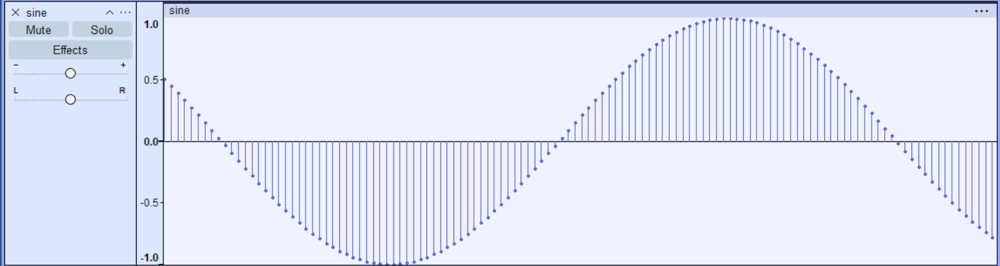

# 440 Hz Sine Wave Generator (Raw PCM in C)

This project demonstrates how **digital audio works at the lowest level** by generating a **440 Hz sine wave** and writing it as **raw PCM audio** using C.

Instead of using audio libraries, the program mathematically generates the waveform and stores the samples directly as binary data.

## Key Concepts

* **Analog vs Digital Sound** – Real-world sound is continuous, but computers store discrete numbers.
* **Sine Wave** – The simplest audio signal and the building block of all complex sounds.
* **PCM (Pulse Code Modulation)** – Representing sound by sampling the waveform at regular intervals.
* **Sampling Rate** – 44,100 samples per second (CD quality), based on the Nyquist theorem.
* **Bit Depth** – 16-bit samples (`int16_t`) giving 65,536 possible amplitude values.

## How It Works

1. Generate a sine wave using
   `sin(2π × frequency × t)`
2. Sample the wave **44,100 times per second**
3. Scale values from **[-1.0, 1.0] → [-32768, 32767]**
4. Store samples as **16-bit integers**
5. Write raw binary samples to a file


The bars in the image are showing the discrete points where the sample rate has been stored , which shows that the sin is not continious here but just a collection 
of large discrete values combined together.

Audio software can read these samples and reconstruct the sound wave.

## Build

```bash
gcc sinewave.c -o sinewave -lm
```

## Run

```bash
./sinewave
```

## Listening to the Output

Open the generated file in audio software such as **Audacity** with:

* Encoding: Signed 16-bit PCM
* Sample Rate: 44100 Hz
* Channels: Mono

You should hear a **440 Hz tone (musical note A)**.

## Why This Project Matters

This project shows the complete path from:

```
Mathematical signal → Sampling → PCM encoding → Binary file → Sound playback
```

This gives me a raw idea for  **digital signal processing, audio engines, and embedded systems**
